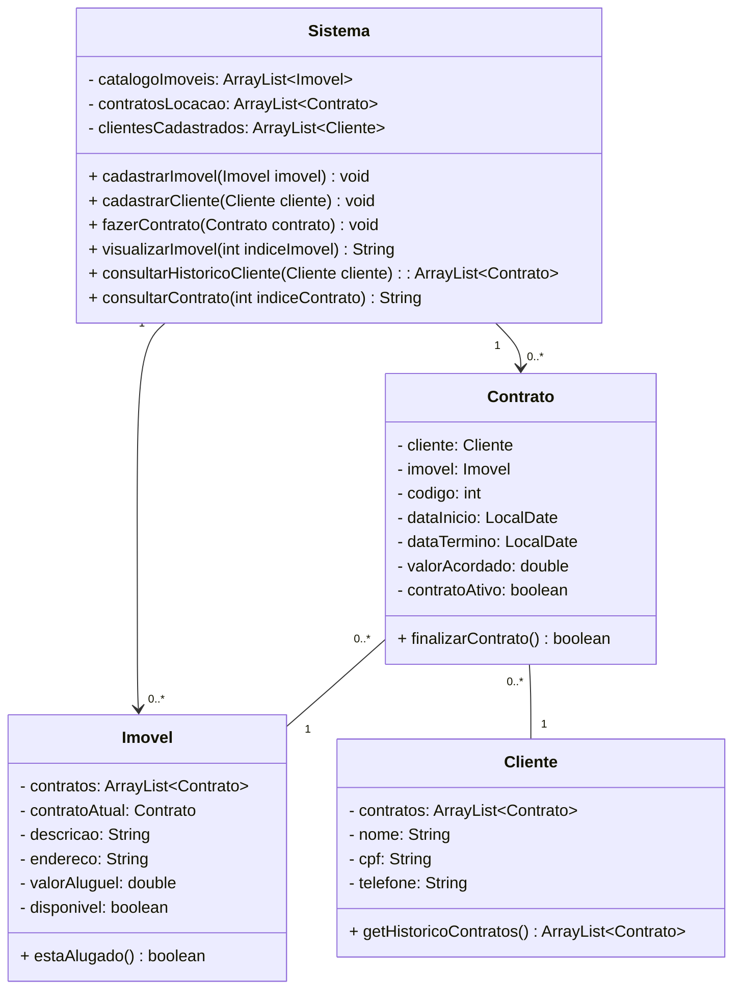

# Diagrama UML para contrato de locação

```mermaid
classDiagram
    
    Contrato "0..*" -- "1" Imovel
    Contrato "0..*" -- "1" Cliente
    Sistema "1" --> "0..*" Imovel 
    Sistema "1" --> "0..*" Contrato
    
    class Contrato {
        - cliente: Cliente 
        - imovel: Imovel 
        - codigo: int 
        - dataInicio: LocalDate 
        - dataTermino: LocalDate 
        - valorAcordado: double
        - contratoAtivo: boolean
        + finalizarContrato() boolean
    }
    
    class Cliente {
        - contratos: ArrayList~Contrato~
        - nome: String
        - cpf: String 
        - telefone: String 
        + getHistoricoContratos() ArrayList~Contrato~
    }
    
    class Imovel {
        - contratos: ArrayList~Contrato~
        - contratoAtual: Contrato 
        - descricao: String 
        - endereco: String 
        - valorAluguel: double 
        - disponivel: boolean
        + estaAlugado() boolean
    }

    class Sistema {
        - catalogoImoveis: ArrayList~Imovel~
        - contratosLocacao: ArrayList~Contrato~
        - clientesCadastrados: ArrayList~Cliente~
        + cadastrarImovel (Imovel imovel) void
        + cadastrarCliente (Cliente cliente) void
        + fazerContrato (Contrato contrato) void
        + visualizarImovel (int indiceImovel) String
        + consultarHistoricoCliente(Cliente cliente): ArrayList~Contrato~
        + consultarContrato (int indiceContrato) String
    }

```