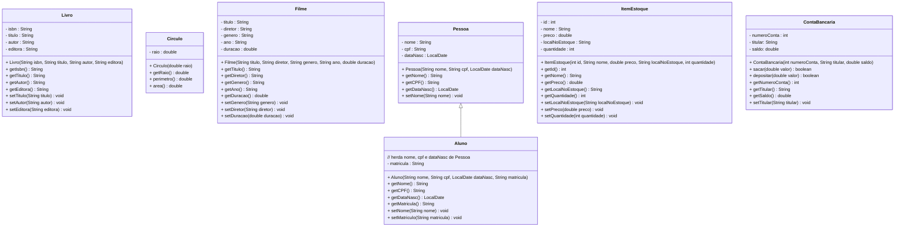

# Atividade 3

## TADS

```mermaid
classDiagram
    
    class Livro {
        - isbn : String
        - titulo : String
        - autor : String
        - editora : String
        
        + Livro (String isbn, String titulo, String autor, String editora)
        + getIsbn() String
        + getTitulo() String
        + getAutor() String
        + getEditora() String
        + setTitulo(String titulo) void
        + setAutor(String autor) void
        + setEditora(String editora) void
    }
    
    class Circulo {
        - raio : double
        
        + Circulo(double raio)
        + getRaio() double
        + perimetro() double
        + area() double
        
    }
    
    class Filme {
        - titulo : String
        - diretor : String
        - genero : String
        - ano : String
        - duracao : double

        + Filme (String titulo, String diretor, String genero, String ano, double duracao)
        + getTitulo() String
        + getDiretor() String
        + getGenero() String
        + getAno() String
        + getDuracao() double
        + setGenero(String genero) void
        + setDiretor(String diretor) void
        + setDuracao(double duracao) void

    }
    
    class Pessoa {
        - nome : String
        - cpf : String
        - dataNasc : LocalDate
        
        + Pessoa(String nome, String cpf, LocalDate dataNasc)
        + getNome() String
        + getCPF() String
        + getDataNasc() LocalDate
        + setNome(String nome) void
    }

    Pessoa <|-- Aluno
    
    class Aluno {
        // herda nome, cpf e dataNasc de Pessoa
        - matricula : String

        + Aluno(String nome, String cpf, LocalDate dataNasc, String matricula)
        + getNome() String
        + getCPF() String
        + getDataNasc() LocalDate
        + getMatricula() String
        + setNome(String nome) void
        + setMatriculo(String matricula) void
    }
    
    class ItemEstoque {
        - id : int
        - nome : String
        - preco : double
        - localNoEstoque : String
        - quantidade : int
        
        + ItemEstoque(int id, String nome, double preco, String localNoEstoque, int quantidade)
        + getId() int
        + getNome() String
        + getPreco() double
        + getLocalNoEstoque() String
        + getQuantidade() int
        + setLocalNoEstoque(String localNoEstoque) void
        + setPreco(double preco) void
        + setQuantidade(int quantidade) void
    }
    
    class ContaBancaria {
        - numeroConta : int
        - titular: String
        - saldo: double
        
        + ContaBancaria(int numeroConta, String titular, double saldo)
        + sacar(double valor) boolean
        + depositar(double valor) boolean
        + getNumeroConta() int
        + getTitular() String
        + getSaldo() double
        + setTitular(String titular) void
    }
```